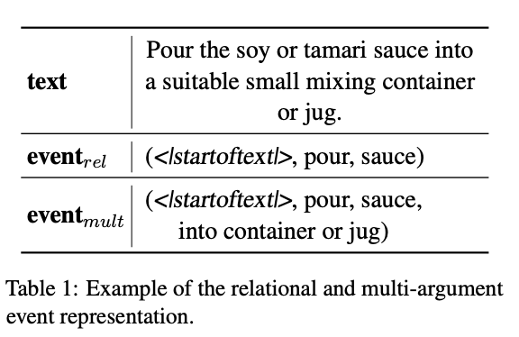

# Combining Tradition with Modernness: Exploring Event Representations in Vision-and-Language Models for Visual Goal–Step Inference

This is the code for our paper at ACL 2023 SRW:  
[Combining Tradition with Modernness: Exploring Event Representations in Vision-and-Language Models for Visual Goal–Step Inference](https://aclanthology.org/2023.acl-srw.36/)

## Dataset

We use the data provided by [Yang et al., 2021](https://arxiv.org/abs/2104.05845). The original dataset is available [here](https://drive.google.com/drive/folders/1hjjcNSUSqv8AbA7R-5lIKmui-ySCEWJw?usp=sharing). We preprocessed the data as described in our paper. The data for the intermediate steps described in the following section can be found [here](https://drive.google.com/drive/folders/1SGpkE01156NmgwT4BXXjrSq3TBoVUNGT?usp=share_link).

## Usage
- **Step 1**: Run code in `./data_preprocessing/`.
- **Step 2**: Run code in `./event_representations/`.
- **Step 3**: Run code in `./analysis/`.

## Event Representations

## Inputs and Hyperparameters

## Results

